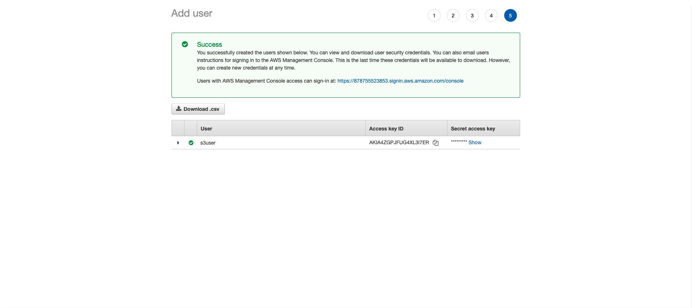

# Connect AWS S3 in python using boto3

# Introduction

In this article, it shows how to connect AWS S3 in python by using boto3 package.

# Prerequistes

MacOS

Jupyter-notebook  6.2.0

python 3.8.6

# Step 1 - Create IAM User in AWS 

AWS IAM is short for Identity and Access Management. You could set/modify groups, users, roles, or other policies in IAM. We will create a new AWS user with AWS S3 access. 

* Add new user


* Set user name


* Assign user S3 access

There are several options you can choose in thie step. You can set S3 full access, S3 only read, access for specific bucket, etc. Here I will choose AmazonS3FullAccess.


* Record user Access key ID and Secret access key

Copy and paste the user's Access key ID and Secret access key somewhere. It is very important. We are going to use this strings in boto3 connection configuration.



# Step 2 - Install boto3

run code in jupyter python file
```
pip install boto3
```

then

```
import boto3
```

# Step 3 - Set boto3 configuration 

# Step 4 - Read S3 file in your bucket


